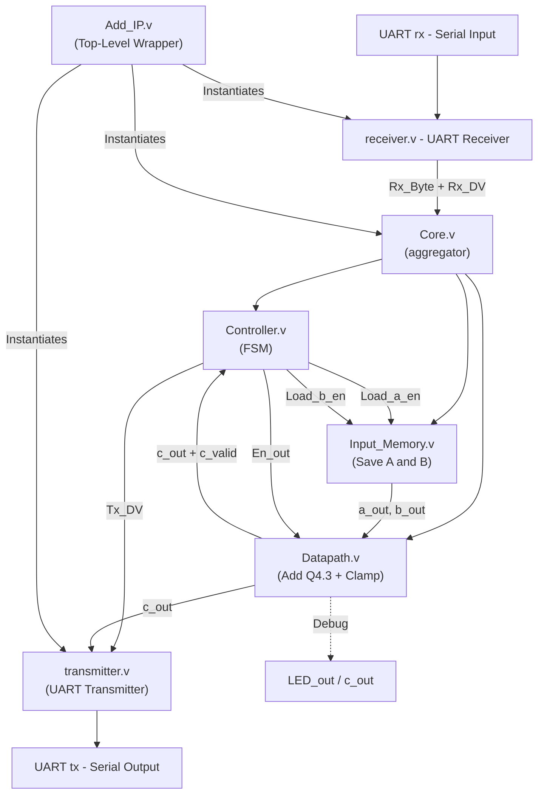

# Adder Fixed Point

## Overview

This project implements a simple fixed-point adder IP in Verilog, demonstrating modular digital design, UART-based data communication, and fixed-point arithmetic. The design includes a UART receiver, input memory, controller (FSM), datapath for computation, and a UART transmitter for output. All modules are integrated in a top-level IP core.

## 📁 Project Structure

- `receiver.v`: UART receiver module, receives serial data and outputs valid 8-bit bytes.
- `Input_Memory.v`: Stores input operands received from UART for computation.
- `Controller.v`: Finite State Machine (FSM) controlling the data flow and computation process.
- `Datapath.v`: Performs fixed-point addition on the input operands.
- `transmitter.v`: UART transmitter module, sends the computed result as serial data.
- `Core.v`: Main processing module, connects all submodules and manages data/control signals.
- `Add_IP.v`: Top-level wrapper, instantiates the core and UART interface modules.

## Module Descriptions

### 📤 `receiver.v`

Implements a UART receiver. It samples the serial input (`Rx_in`), detects start/data/stop bits, and outputs each received byte (`Rx_Byte_out`) along with a data valid flag (`Rx_DV_out`). Synchronizes input and uses a state machine for robust reception.

**Ports:**
- `CLK`: System clock.
- `Rx_in`: UART serial input.
- `Rx_DV_out`: Data valid flag (high for one clock when a byte is received).
- `Rx_Byte_out`: 8-bit received data.

### 📤 `Input_Memory.v`

Stores two signed 8-bit operands received from UART. Controlled by the FSM via enable signals, and provides operands to the datapath for computation.

**Ports:**
- `CLK`, `RST`: Clock and reset.
- `Load_a_en_in`, `Load_b_en_in`: Enable signals to load operand A/B.
- `Rx_Byte_in`: Data from receiver.
- `a_out`, `b_out`: Output operands for computation.

### 📤 `Controller.v`

Implements a finite state machine (FSM) to control the data flow:
- Waits for valid input bytes.
- Enables memory loading.
- Triggers computation.
- Signals result transmission.

**Ports:**
- `CLK`, `RST`: Clock and reset.
- `Rx_Byte_in`, `Rx_DV_in`: Data and valid flag from receiver.
- `Tx_Done_in`: Transmission done flag from transmitter.
- `c_valid_in`: Computation done flag from datapath.
- Control outputs: `En_out`, `Load_a_en_out`, `Load_b_en_out`, `Tx_DV_out`.

### 📤 `Datapath.v`

Performs signed fixed-point addition (Q4.3 format) on the two input operands and outputs the result and a valid flag.

**Ports:**
- `CLK`, `RST`: Clock and reset.
- `En_in`: Enable signal for computation.
- `a_in`, `b_in`: Input operands.
- `c_out`: Computed result.
- `c_valid_out`: Result valid flag.

### 📤 `transmitter.v`

Implements a UART transmitter. Accepts an 8-bit data input and a data valid flag, then serializes and transmits the data over UART.

**Ports:**
- `CLK`, `Tx_Byte_in`, `Tx_DV_in`: Clock, data, and valid flag.
- `Tx_out`: UART serial output.
- `Tx_Done_out`: Transmission done flag.

### 📤 `Core.v`

Main processing module. Connects the receiver, input memory, controller, datapath, and transmitter. Manages all data and control signals between modules.

**Ports:**
- `CLK`, `RST`: Clock and reset.
- `Rx_Byte_in`, `Rx_DV_in`: Data and valid flag from receiver.
- `Tx_Done_in`: Transmission done flag.
- `Tx_DV_out`, `Tx_Byte_out`: Data and valid flag to transmitter.
- `c_out`: Debug output.

### 📤 `Add_IP.v`

Top-level wrapper module. Instantiates the core, receiver, and transmitter, and connects them to the external UART interface.

**Ports:**
- `clk`, `rst_n`: System clock and reset.
- `rx`: UART serial input.
- `tx`: UART serial output.

## 🔄 Detailed Data Flow

