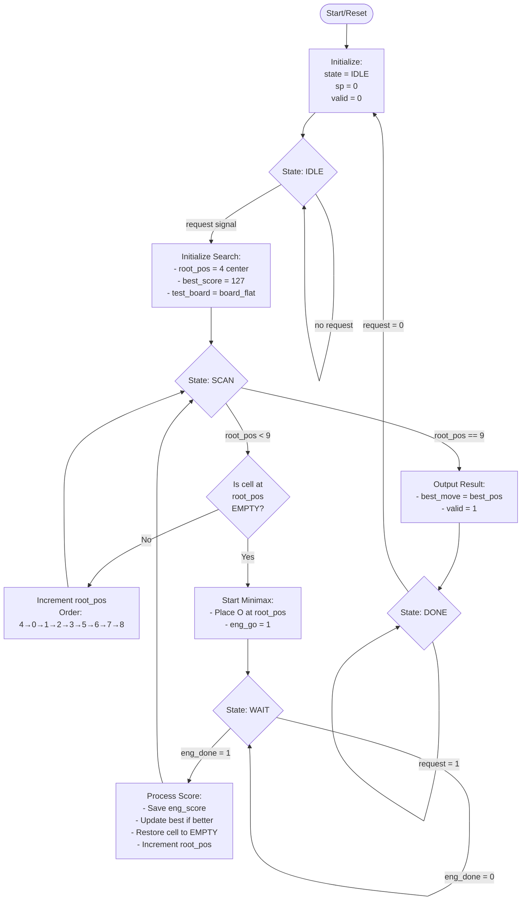
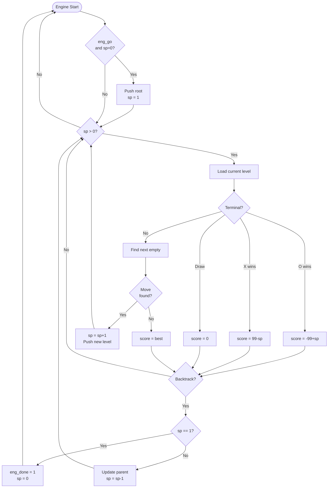

# Minimax Module Flowchart

## Main FSM

```mermaid
flowchart TB
    Start([Start/Reset]) --> Init[Initialize:<br/>state = IDLE<br/>sp = 0<br/>valid = 0]
    
    Init --> IDLE{State: IDLE}
    
    IDLE -->|no request| IDLE
    IDLE -->|request signal| InitSearch[Initialize Search:<br/>- root_pos = 4 center<br/>- best_score = 127<br/>- test_board = board_flat]
    
    InitSearch --> SCAN{State: SCAN}
    
    SCAN -->|root_pos == 9| OutputDone[Output Result:<br/>- best_move = best_pos<br/>- valid = 1]
    
    SCAN -->|root_pos < 9| CheckCell{Is cell at<br/>root_pos<br/>EMPTY?}
    
    CheckCell -->|No| NextPos[Increment root_pos<br/>Order: 4→0→1→2→3→5→6→7→8]
    NextPos --> SCAN
    
    CheckCell -->|Yes| StartEngine[Start Minimax:<br/>- Place O at root_pos<br/>- eng_go = 1]
    
    StartEngine --> WAIT{State: WAIT}
    
    WAIT -->|eng_done = 0| WAIT
    WAIT -->|eng_done = 1| ProcessScore[Process Score:<br/>- Save eng_score<br/>- Update best if better<br/>- Restore cell to EMPTY<br/>- Increment root_pos]
    
    ProcessScore --> SCAN
    
    OutputDone --> DONE{State: DONE}
    
    DONE -->|request = 1| DONE
    DONE -->|request = 0| Init
```

## Minimax Engine

```mermaid
graph TD
    EngStart([Engine Start]) --> ChkGo{eng_go<br/>and sp=0?}
    ChkGo -->|Yes| Push[Push root<br/>sp = 1]
    Push --> Loop
    ChkGo -->|No| Loop
    
    Loop{sp > 0?} -->|No| EngStart
    Loop -->|Yes| Load[Load current level]
    
    Load --> Term{Terminal?}
    Term -->|O wins| ScoreO[score = -99+sp]
    Term -->|X wins| ScoreX[score = 99-sp]
    Term -->|Draw| ScoreD[score = 0]
    
    ScoreO --> Back
    ScoreX --> Back
    ScoreD --> Back
    
    Term -->|No| Find[Find next empty]
    Find --> Found{Move<br/>found?}
    
    Found -->|Yes| PushNew[sp = sp+1<br/>Push new level]
    PushNew --> Loop
    
    Found -->|No| UseBest[score = best]
    UseBest --> Back
    
    Back{Backtrack?} -->|No| Loop
    Back -->|Yes| ChkSp{sp == 1?}
    
    ChkSp -->|Yes| Return[eng_done = 1<br/>sp = 0]
    Return --> EngStart
    
    ChkSp -->|No| Update[Update parent<br/>sp = sp-1]
    Update --> Loop
```