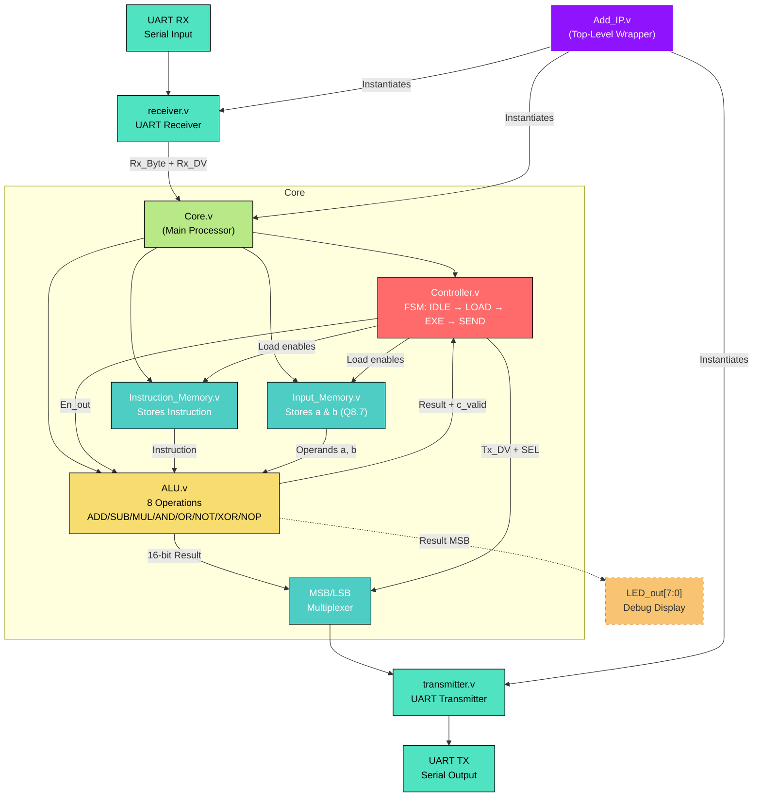

# Tiny CPU

## Overview

**Tiny CPU** is a compact fixed-point processor implemented entirely in Verilog, designed to operate as a soft IP core with a simple UART interface (115200 baud, 8N1).  
It supports eight arithmetic and logic operations on **signed Q8.7 fixed-point numbers** (16-bit, range −256.0 to +255.9921875).

Communication protocol is extremely straightforward:  
→ Send **5 consecutive bytes**: `[Instruction][A_MSB][A_LSB][B_MSB][B_LSB]`  
← Automatically receive **2 bytes** result: `[C_MSB][C_LSB]`  
No complex handshaking required – fully automatic.

## Key Features

- Number format: **signed Q8.7** (8 integer bits + 7 fractional bits)
- Eight instructions: `NOP`, `ADD`, `SUB`, `MUL`, `AND`, `OR`, `NOT`, `XOR`
- Saturating arithmetic on ADD/SUB (±32767 / −32768)
- Correct Q8.7 × Q8.7 → Q8.7 multiplication (extracts bits [23:7])
- Single-cycle latency for all operations
- UART 115200 bps interface
- Fully synchronous design with active-low reset
- Debug: 8-bit LED displays the MSB of the result

## Project Structure

- `receiver.v`          → UART receiver (parameterized baud rate)
- `transmitter.v`       → UART transmitter
- `Instruction_Memory.v` → Stores the 8-bit instruction
- `Input_Memory.v`      → Stores operands A and B (16-bit each, byte-by-byte loading)
- `Controller.v`        → Main FSM (IDLE → LOAD → EXE → SEND)
- `ALU.v`               → Computation unit (8 Q8.7 operations)
- `ADD_SUB_Sharing.v`   → Highly optimized shared adder/subtractor with saturation
- `Core.v`              → Integrates Controller + Memories + ALU
- `Add_IP.v`            → Top-level module (connects UART RX/TX and exposes LED debug)

## Module Descriptions

### receiver.v
UART receiver module (115200 baud, parameterizable via `CLKS_PER_BIT`). Samples the serial input, detects start/stop bits, and outputs an 8-bit byte with a one-cycle `Rx_DV_out` pulse when reception is complete. Double flip-flop synchronisation for metastability protection.

**Ports:**
- `CLK`              : System clock
- `Rx_in`            : UART serial input
- `Rx_DV_out`        : Data valid (1-cycle pulse)
- `Rx_Byte_out[7:0]` : Received byte

### transmitter.v
UART transmitter module (115200 baud). Serialises an 8-bit data word (`Tx_Byte_in`) when `Tx_DV_in` is asserted. Outputs `Tx_Active_out` (high during transmission) and a one-cycle `Tx_Done_out` pulse when finished.

**Ports:**
- `CLK`, `Tx_DV_in`, `Tx_Byte_in[7:0]`
- `Tx_out`           : UART serial output
- `Tx_Done_out`      : Transmission complete flag

### Instruction_Memory.v
Single 8-bit register that stores the instruction byte. Loaded only when `Load_INS_en_in` is high (i.e., first received byte in IDLE state).

**Ports:**
- `CLK`, `RST`
- `Load_INS_en_in`, `Rx_Byte_in[7:0]`
- `INS_out[7:0]`     : Current instruction fed to ALU

### Input_Memory.v
Two 16-bit signed registers for operands A and B (Q8.7 format). Bytes are loaded separately via four dedicated enable signals (MSB/LSB of A and B).

**Ports:**
- `CLK`, `RST`
- `Load_MSB_a_en_in`, `Load_LSB_a_en_in`, `Load_MSB_b_en_in`, `Load_LSB_b_en_in`
- `Rx_Byte_in[7:0]`
- `a_out[15:0]`, `b_out[15:0]` : Operands to ALU

### Controller.v
Main 4-state FSM (`IDLE → LOAD → EXE → SEND`) that orchestrates the entire operation.  
- Counts 5 incoming bytes  
- Asserts load enables for instruction and operands  
- Triggers ALU execution (`En_out`)  
- Sends result as two bytes (MSB first, then LSB) using `Tx_DV_out` and `MLSB_SEL_Tx_Byte_out`

**Key ports:**
- `Rx_DV_in`, `c_valid_in`, `Tx_Done_in`
- `En_out`, all `Load_*_en_out`, `Tx_DV_out`, `MLSB_SEL_Tx_Byte_out`

### ADD_SUB_Sharing.v
Highly optimised shared adder/subtractor with built-in signed saturation.  
Uses single 17-bit adder + XOR + carry-in trick to perform both ADD and SUB. Automatically clamps result to ±32767 / −32768 (Q8.7 range).

**Ports:**
- `ADD_SUB_Select_in` (0 = ADD, 1 = SUB)
- `a_in[15:0]`, `b_in[15:0]` (Q8.7)
- `c_out[15:0]`      : Saturated result

### ALU.v
Datapath core supporting all 8 instructions in a single clock cycle when `En_in` is high.  
- Arithmetic: `NOP`, saturating `ADD`/`SUB`, Q8.7-correct `MUL` (takes bits [23:7])
- Logic: `AND`, `OR`, `NOT`, `XOR`  
Outputs result on `c_out[15:0]` and asserts `c_valid_out` for one cycle.

**Ports:**
- `CLK`, `RST`, `En_in`, `INS_in[7:0]`
- `a_in[15:0]`, `b_in[15:0]`
- `c_out[15:0]`, `c_valid_out`

### Core.v
Integration module that connects Controller, Instruction_Memory, Input_Memory, and ALU. Handles internal wiring and multiplexes the 16-bit result into two UART bytes (MSB/LSB) using `MLSB_SEL_Tx_Byte_out`.

**Ports:**
- All UART-facing signals
- `c_out[7:0]`       : Debug output (MSB of result → LED)

### Add_IP.v
Top-level wrapper. Instantiates `receiver`, `Core`, and `transmitter`. Exposes clean external UART pins and 8-bit LED debug port showing the MSB of the result.

**Ports:**
- `CLK`, `RST` (active-low)
- `Rx_in`, `Tx_out`
- `LED_out[7:0]`     : c_out[15:8]

